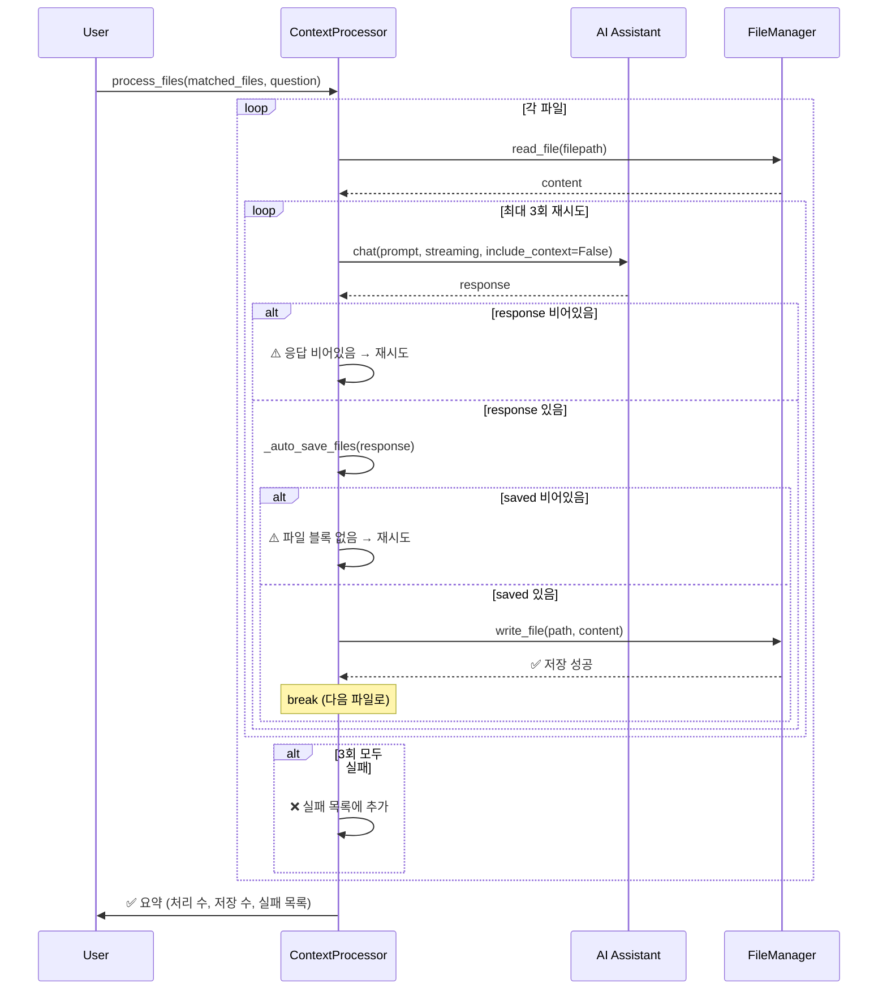

# FSD v1.0.076 — `/auto_context` 응답 저장 실패 시 재시도 기능

| 항목 | 내용 |
|---|---|
| 문서 버전 | v1.0.076 |
| 작성일 | 2026-03-08 |
| 구현일 | 2026-03-08 |
| 상태 | ✅ 구현 완료 |
| 선행 문서 | FSD v1.0.049 (`/auto_context` 파일 단위 자동 처리), BUG v1.0.062 (auto-save 미태그 코드블록 수정) |
| 대상 파일 | `src/context_processor.py`, `gen-ai-chat-code.py`, `claude-ai-chat-code.py`, `gemini-ai-chat-code.py` |
| 테스트 파일 | `tests/test_context_processor.py` |

---

## 1. 개요

### 1.1 목적

`/auto_context` 명령어로 매칭된 파일을 순차 처리하는 과정에서, **AI 응답의 파일 저장이 실패**하는 경우 현재는 "⚠️ 응답에 저장할 파일 블록이 없습니다."를 출력하고 다음 파일로 넘어간다. 이로 인해 AI 모델이 올바른 `\`\`\`filename:` 형식으로 응답하지 않았거나, 일시적 API 오류로 불완전한 응답이 반환된 경우 결과물이 누락된다.

본 문서는 **응답 저장 실패 시 최대 3회까지 재시도**하여 모델 응답 오류를 최소화하는 기능 개선을 정의한다.

### 1.2 배경

| 문제 | 설명 |
|---|---|
| 모델 응답 형식 불일치 | AI가 `\`\`\`filename:` 블록 없이 일반 텍스트로만 응답하는 경우 저장 대상 없음 |
| 불완전한 응답 | 스트리밍 중단, 토큰 한도 초과 등으로 `\`\`\`filename:` 블록이 잘리거나 닫히지 않은 경우 |
| 파일 쓰기 실패 | 디스크 권한, 경로 오류 등으로 `write_file()` 자체가 실패하는 경우 |
| 결과물 누락 | 위 케이스에서 재시도 없이 다음 파일로 넘어가므로, 전체 배치 처리 결과에 빈 구멍이 발생 |

### 1.3 범위

- `src/context_processor.py` — `process_files()` 메서드에 재시도 로직 추가
- 3개 엔트리 포인트(`gen-ai-chat-code.py`, `claude-ai-chat-code.py`, `gemini-ai-chat-code.py`)는 호출 구조 변경 없음 (변경 불필요)
- 재시도 최대 횟수: **3회** (환경변수 `AUTO_CONTEXT_MAX_RETRIES`로 변경 가능, 기본값 3)

---

## 2. 현황 분석

### 2.1 현재 `process_files()` 흐름 (context_processor.py:43-112)

```python
def process_files(self, matched_files, question):
    for idx, filepath in enumerate(matched_files, 1):
        # 1. 파일 읽기
        content = self.file_manager.read_file(filepath)

        # 2. 프롬프트 조합
        prompt = self._build_prompt(question, rel_path, content)

        # 3. AI에 전송
        response = self.assistant.chat(prompt, streaming=self.streaming, include_context=False)

        # 4. 응답에서 파일 추출 및 자동 저장
        if response:
            saved = self._auto_save_files(self.normalize_backtick_blocks(response))
            saved_count += len(saved)

            if not saved:
                print("⚠️  응답에 저장할 파일 블록이 없습니다.")  # ← 재시도 없이 종료
```

### 2.2 저장 실패 시나리오

| # | 시나리오 | `_auto_save_files()` 반환값 | 현재 동작 |
|---|---|---|---|
| S-01 | AI 응답에 `\`\`\`filename:` 블록 없음 | `[]` (빈 리스트) | ⚠️ 경고 출력 후 다음 파일 |
| S-02 | `\`\`\`filename:` 블록은 있으나 닫히지 않음 | `[]` (빈 리스트) + ⚠️ 닫히지 않은 블록 경고 | 다음 파일 |
| S-03 | `write_file()` 일부 실패 | 성공한 파일만 포함된 리스트 | 일부만 저장 |
| S-04 | AI API 오류로 `response`가 빈 문자열 | 저장 로직 미진입 | 다음 파일 |

### 2.3 3개 엔트리 포인트 `/auto_context` 핸들러 호출부

세 스크립트 모두 동일한 패턴으로 `ContextProcessor`를 생성·호출하며, 재시도 로직은 `ContextProcessor` 내부에서 처리되므로 **엔트리 포인트 수정이 불필요**하다.

```python
# gemini-ai-chat-code.py (Line 334-341)
# claude-ai-chat-code.py (Line 482-489)
# gen-ai-chat-code.py (Line 492-499)
from src.context_processor import ContextProcessor
processor = ContextProcessor(
    assistant=assistant,
    file_manager=assistant.file_manager,
    streaming=streaming  # 또는 streaming_mode
)
processor.process_files(matched_files, question)
```

---

## 3. 요구사항

### 3.1 기능 요구사항

| ID | 요구사항 | 우선순위 |
|---|---|---|
| FR-076-001 | 응답 저장 실패(저장된 파일 수 = 0) 시 동일 파일에 대해 AI 재전송 및 재저장을 **최대 3회** 시도 | 필수 |
| FR-076-002 | 각 재시도마다 시도 횟수(🔄 재시도 [n/3])를 표시하여 사용자에게 진행 상태를 알림 | 필수 |
| FR-076-003 | 3회 모두 실패 시 해당 파일을 `실패 목록`에 기록하고 다음 파일로 진행 | 필수 |
| FR-076-004 | 전체 처리 완료 시 실패 목록이 있으면 실패한 파일 경로를 요약 출력 | 필수 |
| FR-076-005 | 최대 재시도 횟수를 환경변수 `AUTO_CONTEXT_MAX_RETRIES`로 설정 가능 (기본값: 3) | 선택 |
| FR-076-006 | `_auto_save_files()` 반환값이 빈 리스트(`[]`)인 경우를 "저장 실패"로 판정 | 필수 |
| FR-076-007 | `response` 자체가 빈 문자열이거나 `None`인 경우도 "저장 실패"로 판정하여 재시도 | 필수 |
| FR-076-008 | 재시도 시 AI에 **동일 프롬프트**를 재전송 (프롬프트 변경 없음) | 필수 |
| FR-076-009 | 재시도 간 딜레이는 두지 않음 (즉시 재시도) | 필수 |

### 3.2 비기능 요구사항

| ID | 요구사항 |
|---|---|
| NFR-076-001 | 재시도 로직은 `ContextProcessor.process_files()` 내부에만 구현하여 외부 인터페이스 변경 최소화 |
| NFR-076-002 | 기존 `Ctrl+C` 인터럽트 핸들링은 재시도 중에도 동일하게 동작 |

---

## 4. 구현 사양

### 4.1 `src/context_processor.py` — `process_files()` 변경

#### 4.1.1 `__init__()` 변경

```python
import os

def __init__(self, assistant, file_manager, streaming: bool = True):
    """
    Args:
        assistant: AI 어시스턴트 인스턴스 (chat 메서드 필요)
        file_manager: FileManager 인스턴스
        streaming: 스트리밍 모드 여부
    """
    self.assistant = assistant
    self.file_manager = file_manager
    self.streaming = streaming
    # FR-076-005: 환경변수로 최대 재시도 횟수 설정 (기본값: 3)
    self.max_retries = max(1, int(os.getenv("AUTO_CONTEXT_MAX_RETRIES", "3")))
```

#### 4.1.2 `process_files()` 변경 — 재시도 로직 추가

```python
def process_files(
    self,
    matched_files: List[Path],
    question: str,
) -> Tuple[int, int]:
    """
    매칭된 파일을 1개씩 순차 처리 (저장 실패 시 최대 max_retries회 재시도)

    Args:
        matched_files: 처리할 파일 목록
        question: 사용자가 입력한 작업 지시문

    Returns:
        (처리 파일 수, 저장 파일 수) 튜플
    """
    total = len(matched_files)
    processed_count = 0
    saved_count = 0
    failed_files: List[str] = []  # FR-076-003: 실패 파일 목록

    for idx, filepath in enumerate(matched_files, 1):
        try:
            rel_path = filepath.relative_to(self.file_manager.workspace_dir)
            print(f"\n━━━ [{idx}/{total}] {rel_path} ━━━")

            # 1. 파일 읽기
            print("📖 파일 읽는 중...")
            content = self.file_manager.read_file(filepath)
            if content is None:
                print(f"❌ 파일 읽기 실패: {rel_path}")
                failed_files.append(str(rel_path))
                continue

            # 2. 프롬프트 조합
            prompt = self._build_prompt(question, rel_path, content)

            # 3~4. AI 전송 + 응답 저장 (재시도 포함)
            saved = []
            for attempt in range(1, self.max_retries + 1):
                # 3. AI에 전송
                if attempt == 1:
                    print("🤖 AI 처리 중...")
                else:
                    print(f"🔄 재시도 [{attempt}/{self.max_retries}] AI 재전송 중...")

                response = self.assistant.chat(
                    prompt,
                    streaming=self.streaming,
                    include_context=False
                )

                # FR-076-007: 응답이 비어있는 경우
                if not response:
                    print(f"⚠️  AI 응답이 비어있습니다. (시도 {attempt}/{self.max_retries})")
                    if attempt < self.max_retries:
                        continue
                    else:
                        break

                # 4. 응답에서 파일 추출 및 자동 저장
                saved = self._auto_save_files(
                    self.normalize_backtick_blocks(response)
                )

                # FR-076-006: 저장 성공 판정
                if saved:
                    saved_count += len(saved)
                    break  # 성공 → 다음 파일로
                else:
                    print(f"⚠️  응답에 저장할 파일 블록이 없습니다. (시도 {attempt}/{self.max_retries})")
                    if attempt < self.max_retries:
                        continue  # 재시도
                    # 마지막 시도도 실패

            # 재시도 모두 실패한 경우
            if not saved:
                print(f"❌ {self.max_retries}회 시도 후에도 저장 실패: {rel_path}")
                failed_files.append(str(rel_path))

            processed_count += 1

        except KeyboardInterrupt:
            print(f"\n\n⚠️  사용자 중단 (Ctrl+C)")
            print(f"   처리 완료: {processed_count}/{total}개")
            break
        except Exception as e:
            print(f"❌ 처리 실패: {e}")
            try:
                cont = input("▶ 다음 파일로 계속하시겠습니까? (Y/n): ").strip().lower()
                if cont == 'n':
                    break
            except (EOFError, KeyboardInterrupt):
                break

    # 5. 전체 요약
    print(f"\n{'='*60}")
    print(f"✅ 자동 처리 완료: {processed_count}개 파일 처리, {saved_count}개 파일 저장")

    # FR-076-004: 실패 파일 요약
    if failed_files:
        print(f"\n❌ 저장 실패 파일 ({len(failed_files)}개):")
        for ff in failed_files:
            print(f"   - {ff}")

    print(f"{'='*60}")

    return processed_count, saved_count
```

### 4.2 엔트리 포인트 변경 사항 — 없음

3개 스크립트(`gen-ai-chat-code.py`, `claude-ai-chat-code.py`, `gemini-ai-chat-code.py`)의 `/auto_context` 핸들러 호출부는 변경 없이 유지한다. 재시도 로직은 `ContextProcessor.process_files()` 내부에서 완전히 캡슐화되어 있다.

### 4.3 환경변수 (선택)

| 변수명 | 기본값 | 설명 |
|---|---|---|
| `AUTO_CONTEXT_MAX_RETRIES` | `3` | `/auto_context` 파일 저장 실패 시 최대 재시도 횟수 |

`.env` 파일 예시:
```env
# /auto_context 저장 실패 시 최대 재시도 횟수 (기본값: 3)
AUTO_CONTEXT_MAX_RETRIES=3
```

---

## 5. 프로세스 흐름

### 5.1 개선된 흐름 다이어그램

```
사용자 입력: /auto_context [original/*.md]
       │
       ▼
① 파일 패턴 파싱 + 질문 수집
       │
       ▼
② 파일 매칭 + 확인 질의
       │
       ▼
③ for each file in matched_files:
       │
       ├─→ ③-1. 파일 읽기
       ├─→ ③-2. 프롬프트 조합
       │
       ├─→ ③-3. [attempt = 1] AI에 전송
       │        │
       │        ▼
       │   ③-4. 응답에서 파일 추출 및 자동 저장
       │        │
       │        ├─ 저장 성공 (saved 비어있지 않음) → ✅ 다음 파일로
       │        │
       │        └─ 저장 실패 (saved == []) 또는 응답 비어있음
       │             │
       │             ├─ attempt < max_retries → 🔄 재시도 (③-3으로)
       │             │
       │             └─ attempt == max_retries → ❌ 실패 목록에 추가, 다음 파일로
       │
       ▼
④ 전체 요약 출력 (성공 수, 저장 수, 실패 목록)
```

### 5.2 시퀀스 다이어그램



---

## 6. 사용자 출력 예시

### 6.1 정상 처리 (1회 성공)

```
━━━ [1/3] original/PART 01_01.md ━━━
📖 파일 읽는 중...
🤖 AI 처리 중...
✅ 파일 저장됨: hangle/PART 01_01.md

━━━ [2/3] original/PART 01_02.md ━━━
📖 파일 읽는 중...
🤖 AI 처리 중...
✅ 파일 저장됨: hangle/PART 01_02.md

━━━ [3/3] original/PART 01_03.md ━━━
📖 파일 읽는 중...
🤖 AI 처리 중...
✅ 파일 저장됨: hangle/PART 01_03.md

============================================================
✅ 자동 처리 완료: 3개 파일 처리, 3개 파일 저장
============================================================
```

### 6.2 재시도 성공 (2번째 시도에서 성공)

```
━━━ [1/3] original/PART 01_01.md ━━━
📖 파일 읽는 중...
🤖 AI 처리 중...
⚠️  응답에 저장할 파일 블록이 없습니다. (시도 1/3)
🔄 재시도 [2/3] AI 재전송 중...
✅ 파일 저장됨: hangle/PART 01_01.md

━━━ [2/3] original/PART 01_02.md ━━━
📖 파일 읽는 중...
🤖 AI 처리 중...
✅ 파일 저장됨: hangle/PART 01_02.md

...

============================================================
✅ 자동 처리 완료: 3개 파일 처리, 3개 파일 저장
============================================================
```

### 6.3 3회 모두 실패

```
━━━ [1/3] original/PART 01_01.md ━━━
📖 파일 읽는 중...
🤖 AI 처리 중...
⚠️  응답에 저장할 파일 블록이 없습니다. (시도 1/3)
🔄 재시도 [2/3] AI 재전송 중...
⚠️  응답에 저장할 파일 블록이 없습니다. (시도 2/3)
🔄 재시도 [3/3] AI 재전송 중...
⚠️  응답에 저장할 파일 블록이 없습니다. (시도 3/3)
❌ 3회 시도 후에도 저장 실패: original/PART 01_01.md

━━━ [2/3] original/PART 01_02.md ━━━
📖 파일 읽는 중...
🤖 AI 처리 중...
✅ 파일 저장됨: hangle/PART 01_02.md

...

============================================================
✅ 자동 처리 완료: 3개 파일 처리, 1개 파일 저장

❌ 저장 실패 파일 (1개):
   - original/PART 01_01.md
============================================================
```

---

## 7. 테스트 시나리오

| # | 시나리오 | 기대 결과 |
|---|---|---|
| T-01 | AI 응답에 `\`\`\`filename:` 블록 정상 포함 | 1회 시도로 저장 성공, 재시도 없음 |
| T-02 | 1회차: 블록 없음 → 2회차: 블록 있음 | 🔄 재시도 메시지 출력 후 2회차에 저장 성공 |
| T-03 | 3회 모두 블록 없음 | ❌ 실패 메시지 + 실패 목록에 추가, 다음 파일로 진행 |
| T-04 | AI 응답이 빈 문자열 (API 오류) | "⚠️ AI 응답이 비어있습니다." 출력 후 재시도 |
| T-05 | 재시도 중 사용자 Ctrl+C | 현재까지 처리 결과 요약 출력 후 중단 |
| T-06 | 다중 파일 중 일부만 실패 | 성공 파일은 정상 저장, 실패 파일만 요약에 표시 |
| T-07 | `AUTO_CONTEXT_MAX_RETRIES=5` 설정 | 최대 5회까지 재시도 |
| T-08 | `AUTO_CONTEXT_MAX_RETRIES` 미설정 | 기본값 3회 재시도 |
| T-09 | `write_file()` 실패 (일부 파일만 저장 성공) | `saved` 리스트에 성공 파일만 포함 → 부분 성공으로 처리 (재시도 안 함) |
| T-10 | 3개 스크립트 모두 동일 동작 확인 | `gemini-ai-chat-code.py`, `claude-ai-chat-code.py`, `gen-ai-chat-code.py` 모두 동일 결과 |

---

## 8. 파일 변경 목록

| 파일 | 변경 유형 | 설명 |
|---|---|---|
| `src/context_processor.py` | **수정** | `__init__`에 `max_retries` 추가, `process_files()`에 재시도 루프 + 실패 목록 추가 |
| `tests/test_context_processor.py` | **수정** | 재시도 관련 테스트 케이스 추가 (T-01 ~ T-09) |
| `gen-ai-chat-code.py` | 변경 없음 | `ContextProcessor` 호출부 변경 불필요 |
| `claude-ai-chat-code.py` | 변경 없음 | 동일 |
| `gemini-ai-chat-code.py` | 변경 없음 | 동일 |
| `.env` | 선택 수정 | `AUTO_CONTEXT_MAX_RETRIES` 변수 추가 가능 |

---

## 9. 이슈 및 제약

| # | 내용 |
|---|---|
| 1 | 재시도 시 **동일 프롬프트**를 재전송한다. 프롬프트를 "반드시 `\`\`\`filename:` 형식으로 응답하라"는 지시로 보강하는 것은 본 FSD 범위 외이나, 향후 개선 시 프롬프트에 형식 준수 지시를 추가하는 방안을 검토할 수 있다. |
| 2 | `_auto_save_files()` 반환값이 빈 리스트가 아닌 경우(일부 파일만 저장 성공)는 **재시도하지 않는다**. 일부라도 성공하면 부분 성공으로 처리하여 동일 파일이 중복 저장되는 것을 방지한다. |
| 3 | 재시도 간 딜레이를 두지 않으므로, Rate Limit이 있는 API의 경우 연속 호출이 실패할 수 있다. 필요 시 `time.sleep()` 추가를 검토할 수 있다. |
| 4 | `max_retries`를 0 이하로 설정해도 `max(1, ...)` 처리에 의해 최소 1회는 실행된다. (**구현 완료**) |

---

## 10. 승인

- [x] 개발자 검토 (2026-03-08)
- [x] 테스트 완료 (`tests/test_context_processor.py`)
- [x] 문서 업데이트 완료 (2026-03-08)
